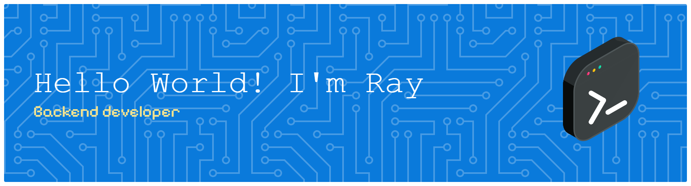

  
  
  
  
  
  
  

###

  
  
  

###

## GitHub Statistics

  <!-- Stats Card -->
  
    
  
  <!-- Streak Stats (URL Baru) -->
  
    
  
  <!-- Top Languages -->
  

###

<!-- Trophy (URL Direct Vercel API) -->

  

###

<picture data-importer="pacman">
  <source media="(prefers-color-scheme: dark)" srcset="https://raw.githubusercontent.com/Hieray-dev/Hieray-dev/pacman-output/pacman-contribution-graph-dark.svg?game=pacman">
  <source media="(prefers-color-scheme: light)" srcset="https://raw.githubusercontent.com/Hieray-dev/Hieray-dev/pacman-output/pacman-contribution-graph.svg?game=pacman">
  
</picture>

###

## Environment & Preferences

### OS
 

### Games
   

---

  

